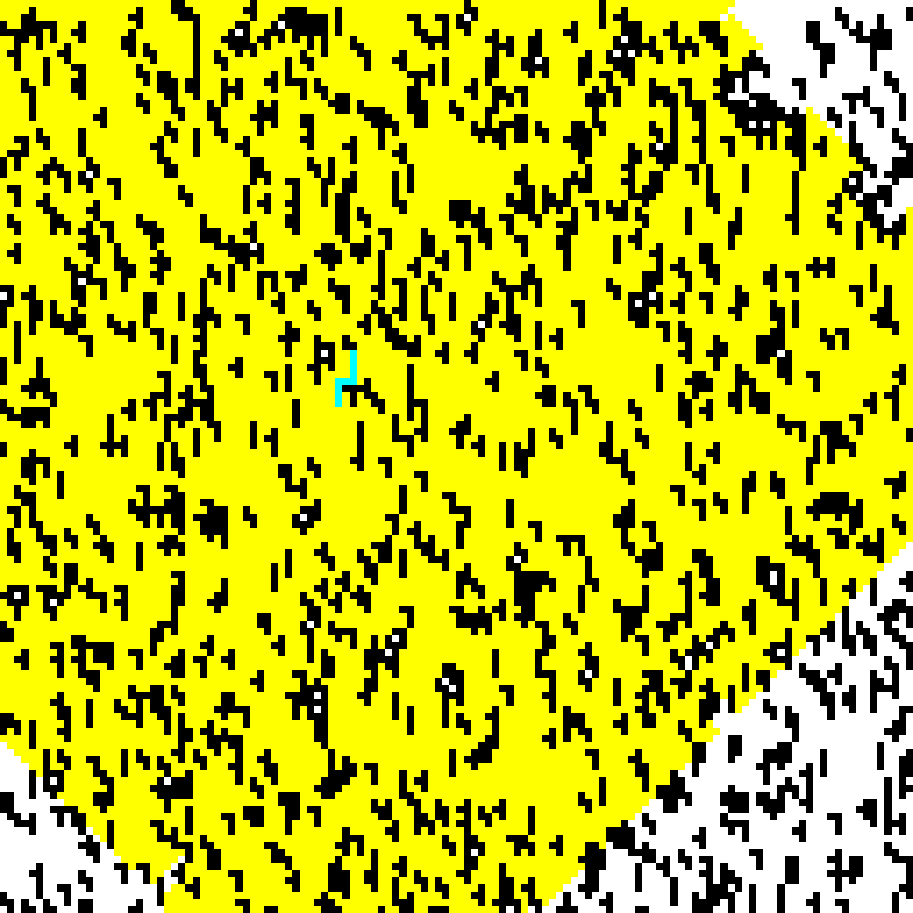
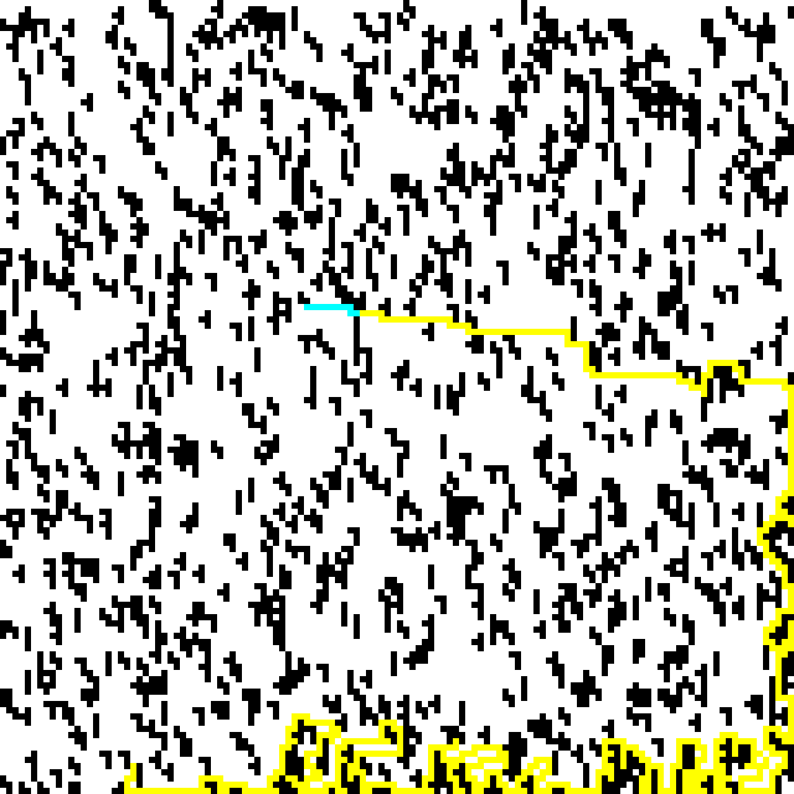
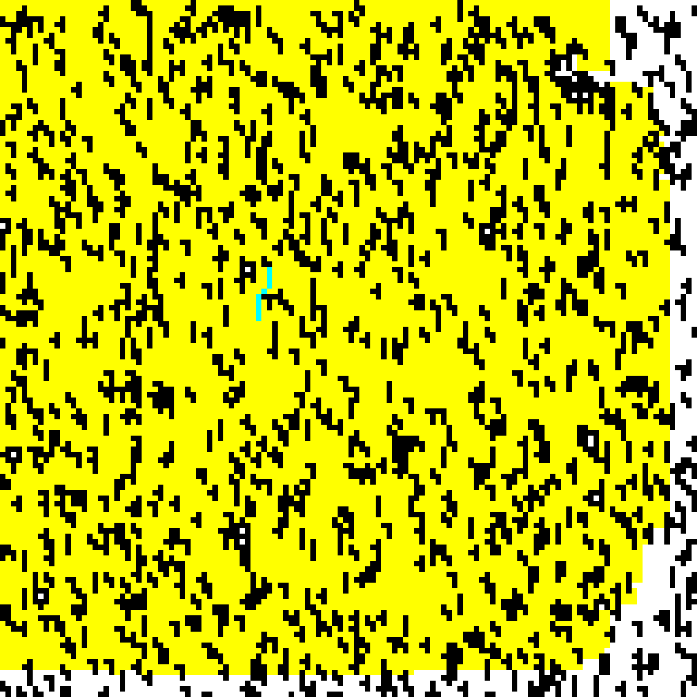

**Homework 1**

**HW 1: Breadth-First Search and Depth-First Search Implementation**

**Table of Contents**
<!-- TOC -->

- [Introduction](#introduction)
- [Breadth-First Search BFS](#breadth-first-search-bfs)
    - [Pseudocode](#pseudocode)
    - [Code Explanation](#code-explanation)
- [Depth-First Search DFS](#depth-first-search-dfs)
    - [Pseudocode: Iterative Version](#pseudocode-iterative-version)
    - [Pseudocode: Recursive Version](#pseudocode-recursive-version)
    - [Code Explanation](#code-explanation)
- [Dijkstra Search](#dijkstra-search)
    - [Pseudocode](#pseudocode)
    - [Code Explanation](#code-explanation)
- [Run the code](#run-the-code)
- [Results](#results)
- [Performance Testing: BFS vs DFS vs Dijkstra](#performance-testing-bfs-vs-dfs-vs-dijkstra)
- [Resources](#resources)

<!-- /TOC -->

# Introduction

- DFS focuses on planning path as fast as possible but fails at guaranteeing the shortest path.
- BFS focuses on providing the shortest path by scanning the whole environment but is time and memory intensive.
- Dijkstra is a bit time consuming compared to BFS but provides the shortest path possible.

# Breadth-First Search (BFS)

**Breadth-first search (BFS)** is an algorithm for searching a tree data structure for a node that satisfies a given property. It starts at the tree root and explores all nodes at the present depth prior to moving on to the nodes at the next depth level. Extra memory, usually a queue, is needed to keep track of the child nodes that were encountered but not yet explored.

Order in which nodes are visited:


## Pseudocode

```python
BFS (G, s) # Where G is the graph and s is the source node
    let Q be queue.
    Q.enqueue( s ) # Inserting s in queue until all its neighbour vertices are marked.
    mark s as visited.

        while ( Q is not empty)
            v  =  Q.dequeue( )# Removing that vertex from queue,whose neighbour will be visited now

            for all neighbours w of v in Graph G # processing all the neighbours of v  
                if w is not visited 
                    Q.enqueue( w ) # Stores w in Q to further visit its neighbour
                    mark w as visited.
```

BFS Search Simulation:


## Code Explanation

Define function to implement BFS Algorithm.

```cpp
void StartSearch::bfs_search(sf::RenderWindow *display_window, bool show_search_animation)
```

Initialize the basic requirements for the implementation. BFS requires a **queue** (FIFO).

```cpp
// Initialize FIFO Queue to Store Neighbour Information
std::queue<std::uint8_t> x_que, y_que;
std::queue<std::string> move_que;
bool path_found = false; // Boolean to determine whether the path is found or not.
```

Append the start position information into the queue.

```cpp
// Push the Start to Queue
y_que.push(start_pos[0]);
x_que.push(start_pos[1]);
move_que.push("");
```

Mark the Start Node as visited.

```cpp
grid_array[start_pos[0]][start_pos[1]] = BLOCK_VISITED; // Mark Start as Visited
```

Run the loop until the queue is empty

```cpp
while (true && (!x_que.empty())) // Continue till the queue is empty or end position is reached
```

Pop the first element from queue for x, y and path

```cpp
// Pop the First Element from Queue
std::uint8_t x = x_que.front();
std::uint8_t y = y_que.front();
std::string path = move_que.front();
x_que.pop();
y_que.pop();
move_que.pop();
```

Check if the popped element is the end position, exit the loop if it is.

```cpp
if ((y == end_pos[0]) && (x == end_pos[1])) // Break if End Point Reached
{
    path_found = true;
    move_que.push(path);
    break;
}
```

Check for the empty elements around the cell, add it in queue if they are empty and marked them as visited.

```cpp
// Look for surrounding Neighbours, if empty then add them to queue and mark them as visited
if (is_right_empty(x, y, true))
{
    x_que.push(x + 1);
    y_que.push(y);
    move_que.push(path + 'R');
}
if (is_down_empty(x, y, true))
{
    x_que.push(x);
    y_que.push(y + 1);
    move_que.push(path + 'D');
}
if (is_left_empty(x, y, true))
{
    x_que.push(x - 1);
    y_que.push(y);
    move_que.push(path + 'L');
}
if (is_up_empty(x, y, true))
{
    x_que.push(x);
    y_que.push(y - 1);
    move_que.push(path + 'U');
}
```

If the end goal is reached, deparse the path (string) and convert it into cell positions and update the display.

```cpp
if (path_found)
{
    std::cout << "Search Complete: " << move_que.back() << std::endl;
    itemize_path(move_que.back()); // Break the Path Strings into coordinated and display them
}
else
    std::cout << "Search Failed!" << std::endl;
system("rm Images/bfs*.png Images/gif.gif");
return;
```



# Depth-First Search (DFS)

**Depth-first search (DFS)** is an algorithm for traversing or searching a tree or graph data structure. The algorithm starts from the root node (choose any node as the root in the case of a graph) and explores along each branch as possible before backtracking. Additional memory (usually a stack) is required to keep track of the nodes discovered so far along a given branch, which facilitates graph backtracking.

Order in which nodes are visited:


The time and space analysis of DFS differs according to its application area. In theoretical computer science, DFS is typically used to traverse an entire graph, and takes time $O(|V|+|E|)$
, where $|V|$ is the number of vertices and $|E|$ the number of edges. This is linear in the size of the graph. In these applications it also uses space $O(|V|)$ in the worst case to store the stack of vertices on the current search path as well as the set of already-visited vertices. Thus, in this setting, the time and space bounds are the same as for breadth-first search and the choice of which of these two algorithms to use depends less on their complexity and more on the different properties of the vertex orderings the two algorithms produce.

Two versions of DFS algorithm that exists:
- Iterative Version (We have programmed this version)
- Recursive Version

## Pseudocode: Iterative Version

```python
DFS-iterative (G, s): # Where G is graph and s is source vertex
    let S be stack
    S.push( s ) # Inserting s in stack 
    mark s as visited.
    
    while ( S is not empty):
        v  =  S.top( ) # Pop a vertex from stack to visit next
        S.pop( )
        for all neighbours w of v in Graph G: # Push all the neighbours of v in stack that are not visited   
            if w is not visited :
                    S.push( w )         
                    mark w as visited
```

## Pseudocode: Recursive Version

```python
DFS-recursive(G, s):
    mark s as visited
    for all neighbours w of s in Graph G:
        if w is not visited:
            DFS-recursive(G, w)
```

DFS Search Simulation:


## Code Explanation

Define function to implement DFS Algorithm.

```cpp
void StartSearch::dfs_search(sf::RenderWindow *display_window, bool show_search_animation)
```

Initialize the basic requirements for the implementation. DFS requires a **stack** (LIFO). A list can be a good implementation to replicate the stack.

```cpp
// Initialize LIFO Stack to store Neighbour Information
std::vector<std::uint8_t> x_stack, y_stack;
std::vector<std::string> move_stack;

bool path_found = false; // Boolean to determine whether the path is found or not
```

Append the start position information into the stack

```cpp
// Push the Start Node to Stack
y_stack.push_back(start_pos[0]);
x_stack.push_back(start_pos[1]);
move_stack.push_back("");
```

Mark the Start Node as visited.

```cpp
grid_array[start_pos[0]][start_pos[1]] = BLOCK_VISITED; // Mark the Start as visited

// Setup marker to mark the visited blocks
sf::RectangleShape mapping_marker(sf::Vector2f(PIXEL_WIDTH, PIXEL_WIDTH));
mapping_marker.setFillColor(MAPPING_COLOR);
```

Run the loop until the stack is empty

```cpp
while (!x_stack.empty())
```

Pop the top element from stack for x, y and path

```cpp
// Pop the last element from the Stack
std::uint8_t x = x_stack.back();
std::uint8_t y = y_stack.back();
std::string path = move_stack.back();
x_stack.pop_back();
y_stack.pop_back();
move_stack.pop_back();
```

Check if the popped element is the end position, exit the loop if it is.

```cpp
if ((y == end_pos[0]) && (x == end_pos[1])) // Break if end point reached
{
    path_found = true;
    move_stack.push_back(path);
    break;
}
```

Check for the empty elements around the cell, add it in stack if they are empty and marked them as visited.

```cpp
// Look for surrounding Neighbours, if empty then add them to stack and mark them as visited
if (is_up_empty(x, y, true))
{
    x_stack.push_back(x);
    y_stack.push_back(y - 1);
    move_stack.push_back(path + 'U');
}
if (is_left_empty(x, y, true))
{
    x_stack.push_back(x - 1);
    y_stack.push_back(y);
    move_stack.push_back(path + 'L');
}
if (is_down_empty(x, y, true))
{
    x_stack.push_back(x);
    y_stack.push_back(y + 1);
    move_stack.push_back(path + 'D');
}
if (is_right_empty(x, y, true))
{
    x_stack.push_back(x + 1);
    y_stack.push_back(y);
    move_stack.push_back(path + 'R');
}
```

If the end goal is reached, deparse the path (string) and convert it into cell positions.

```cpp
if (path_found)
{
    std::cout << "Search Complete: " << move_stack.back() << std::endl;
    std::cout << "Path Length: " << std::to_string(move_stack.back().length()) << "\n";
    itemize_path(move_stack.back()); // Break the Path Strings into coordinated and display them
}
else
    std::cout << "Search Failed!" << std::endl;
system("rm Images/dfs*.png Images/gif.gif");
return;
```



# Dijkstra Search

**Dijkstra search** to find the shortest path between $a$ and $b$. It picks the unvisited vertex with the lowest distance, calculates the distance through it to each unvisited neighbor, and updates the neighbor's distance if smaller. Mark visited (set to red) when done with neighbors.


Dijkstra's Algorithm solves the single source shortest path problem in $O((E + V)logV)$ time, which can be improved to $O(E + VlogV)$ when using a Fibonacci heap.

## Pseudocode

```python
function dijkstra(G, S)
    for each vertex V in G
        distance[V] <- infinite
        previous[V] <- NULL
        If V != S, add V to Priority Queue Q
    distance[S] <- 0
	
    while Q IS NOT EMPTY
        U <- Extract MIN from Q
        for each unvisited neighbour V of U
            tempDistance <- distance[U] + edge_weight(U, V)
            if tempDistance < distance[V]
                distance[V] <- tempDistance
                previous[V] <- U
    return distance[], previous[]
```

## Code Explanation

Define function to implement DFS Algorithm.

```cpp
void StartSearch::dijkstra_search(sf::RenderWindow *display_windows, bool show_search_animation)
```

Set the Distance of all the nodes as *Infinity* to begin the Process.

```cpp
std::uint16_t grid_array_data[GRID_WIDTH][GRID_HEIGHT][3]; // Grid to store parent and distance
for (size_t y = 0; y < GRID_HEIGHT; y++)
    for (size_t x = 0; x < GRID_WIDTH; x++)
        grid_array_data[y][x][2] = UINT16_MAX; // Mark all the nodes at INFINITY distance
```

Initialize the basic requirements for the implementation. Requires a **queue** (FIFO).

```cpp
std::queue<std::uint8_t> x_stack, y_stack; // Initialize the FIFO Queue  to store neighbour information
bool path_found = false; // Boolean to determine whether the path is found or not
```

Append the start position information into the stack

```cpp
// Push the Start Node into the queue
y_stack.push(start_pos[0]);
x_stack.push(start_pos[1]);
```

Mark the Start Node as Parent for itself and Distance as Zero

```cpp
// Set the Parent of Start Node as itself
grid_array_data[start_pos[0]][start_pos[1]][0] = start_pos[0];
grid_array_data[start_pos[0]][start_pos[1]][1] = start_pos[1];
grid_array_data[start_pos[0]][start_pos[1]][2] = 0; // Set the distance of start node as 'zero'
```

Run the loop until the stack is empty

```cpp
while (!x_stack.empty())
```

Pop the first element from queue for x, y and distance

```cpp
// Pop the node information from the queue
std::uint8_t x = x_stack.front();
std::uint8_t y = y_stack.front();
std::uint16_t distance = grid_array_data[y][x][2]; // Retrieve the distance from the grid of the current node

x_stack.pop();
y_stack.pop();
```

Check if the cell is visited or not, Mark as Visited if not and look for neighbours.

```cpp
if (grid_array[y][x] == BLOCK_EMPTY) // Visit the node only if it is empty
    grid_array[y][x] = BLOCK_VISITED; // Mark the Node as visited
```

Check if the popped element is the end position, exit the loop if it is.

```cpp
if ((y == end_pos[0]) && (x == end_pos[1])) // Break if end point is reached
{
    path_found = true;
    break;
}
```

Check for the empty elements around the cell, add it in queue if they are empty.\
Check if their current distance is less than the distance of current node + 1. If it is, update the parent of the cell as current node.

```cpp
if (is_down_empty(x, y, false))
{
    std::uint8_t ny, nx;
    ny = y + 1;
    nx = x;
    x_stack.push(nx);
    y_stack.push(ny);
    if (grid_array_data[ny][nx][2] > distance + 1)
    {
        grid_array_data[ny][nx][0] = y;
        grid_array_data[ny][nx][1] = x;
        grid_array_data[ny][nx][2] = distance + 1;
    }
}
if (is_down_left_empty(x, y, false))
{
    std::uint8_t ny, nx;
    ny = y + 1;
    nx = x - 1;
    x_stack.push(nx);
    y_stack.push(ny);
    if (grid_array_data[ny][nx][2] > distance + 1)
    {
        grid_array_data[ny][nx][0] = y;
        grid_array_data[ny][nx][1] = x;
        grid_array_data[ny][nx][2] = distance + 1;
    }
}
if (is_left_empty(x, y, false))
{
    std::uint8_t ny, nx;
    ny = y;
    nx = x - 1;
    x_stack.push(nx);
    y_stack.push(ny);
    if (grid_array_data[ny][nx][2] > distance + 1)
    {
        grid_array_data[ny][nx][0] = y;
        grid_array_data[ny][nx][1] = x;
        grid_array_data[ny][nx][2] = distance + 1;
    }
}
if (is_up_left_empty(x, y, false))
{
    std::uint8_t ny, nx;
    ny = y - 1;
    nx = x - 1;
    x_stack.push(nx);
    y_stack.push(ny);
    if (grid_array_data[ny][nx][2] > distance + 1)
    {
        grid_array_data[ny][nx][0] = y;
        grid_array_data[ny][nx][1] = x;
        grid_array_data[ny][nx][2] = distance + 1;
    }
}
if (is_up_empty(x, y, false))
{
    std::uint8_t ny, nx;
    ny = y - 1;
    nx = x;
    x_stack.push(nx);
    y_stack.push(ny);
    if (grid_array_data[ny][nx][2] > distance + 1)
    {
        grid_array_data[ny][nx][0] = y;
        grid_array_data[ny][nx][1] = x;
        grid_array_data[ny][nx][2] = distance + 1;
    }
}
if (is_up_right_empty(x, y, false))
{
    std::uint8_t ny, nx;
    ny = y - 1;
    nx = x + 1;
    x_stack.push(nx);
    y_stack.push(ny);
    if (grid_array_data[ny][nx][2] > distance + 1)
    {
        grid_array_data[ny][nx][0] = y;
        grid_array_data[ny][nx][1] = x;
        grid_array_data[ny][nx][2] = distance + 1;
    }
}
if (is_right_empty(x, y, false))
{
    std::uint8_t ny, nx;
    ny = y;
    nx = x + 1;
    x_stack.push(nx);
    y_stack.push(ny);
    if (grid_array_data[ny][nx][2] > distance + 1)
    {
        grid_array_data[ny][nx][0] = y;
        grid_array_data[ny][nx][1] = x;
        grid_array_data[ny][nx][2] = distance + 1;
    }
}
if (is_down_right_empty(x, y, false))
{
    std::uint8_t ny, nx;
    ny = y + 1;
    nx = x + 1;
    x_stack.push(nx);
    y_stack.push(ny);
    if (grid_array_data[ny][nx][2] > distance + 1)
    {
        grid_array_data[ny][nx][0] = y;
        grid_array_data[ny][nx][1] = x;
        grid_array_data[ny][nx][2] = distance + 1;
    }
}
```

If the end goal is reached, loop from the end cell and look for its parents till the start cell is reached.\
The Currently Made list is inverted, so run a process to invert the list.\
Visualize the grid based on the location.

```cpp
if (path_found)
{
    // Start from the end position
    std::uint8_t y, x;
    y = end_pos[0];
    x = end_pos[1];

    std::vector<std::uint8_t> pos;
    pos.push_back(y);
    pos.push_back(x);
    this->position_list.push_back(pos); // Push the location of end position into the coordinate list

    while (true)
    {
        std::uint8_t ny, nx;
        ny = grid_array_data[y][x][0]; // Look for the parents of each cell visited
        nx = grid_array_data[y][x][1];
        y = ny;
        x = nx;
        std::vector<std::uint8_t> pos;
        pos.push_back(y);
        pos.push_back(x);
        this->position_list.push_back(pos); // Push the location of parent into the Coordinate List

        if ((y == start_pos[0]) && (x == start_pos[1])) // Break the Loop when Start position is reached
        {
            std::vector<std::vector<std::uint8_t>> inverted_list;

            while (!this->position_list.empty()) // Invert the whole position list as the current list goes from end position to starting position
            {
                inverted_list.push_back(this->position_list.back());
                this->position_list.pop_back();
            }

            this->position_list.clear();
            for (size_t i = 0; i < inverted_list.size(); i++) // Update the inverted List into Position List
                this->position_list.push_back(inverted_list[i]);
            inverted_list.clear();
            break;
        }
    }

    std::cout << "Path Length: " << std::to_string(this->position_list.size()) << "\n";
    this->cell_count = this->position_list.size(); // Calculate Length
    display_path();                                // Display the Path
}
else
    std::cout << "Search Failed!" << std::endl;
system("rm Images/dij*.png Images/gif.gif");
return;
```



# Run the code
Open a new terminal inside this folder and run:

```shell
make
```

# Results

- Start: [1,1], Goal: [128,128] - BFS vs DFS vs Dijkstra

    

- Start: [50,50], Goal: [124,22] - BFS vs DFS vs Dijkstra

    

# Performance Testing: BFS vs DFS vs Dijkstra


# Resources

- [HackerEarth: Depth First Search](https://www.hackerearth.com/practice/algorithms/graphs/depth-first-search/tutorial/)
- [HackerEarth: Breadth First Search](https://www.hackerearth.com/practice/algorithms/graphs/breadth-first-search/tutorial/)
- [HackerEarth: Dijkstra's Algorithm](https://www.hackerearth.com/practice/notes/dijkstras-algorithm/)
- [Stackoverflow: Stitching Photos together](https://stackoverflow.com/questions/10657383/stitching-photos-together)

# Design Details

- Designed for:
  - Worcester Polytechnic Institute
  - RBE 550-S23-S01: Motion Planning
- Designed by:
  - [Parth Patel](mailto:parth.pmech@gmail.com)

# License

This project is licensed under [GNU General Public License v3.0](https://www.gnu.org/licenses/gpl-3.0.en.html) (see [LICENSE.md](LICENSE.md)).

Copyright 2023 Parth Patel

Licensed under the GNU General Public License, Version 3.0 (the "License"); you may not use this file except in compliance with the License.

You may obtain a copy of the License at

_https://www.gnu.org/licenses/gpl-3.0.en.html_

Unless required by applicable law or agreed to in writing, software distributed under the License is distributed on an "AS IS" BASIS, WITHOUT WARRANTIES OR CONDITIONS OF ANY KIND, either express or implied. See the License for the specific language governing permissions and limitations under the License.